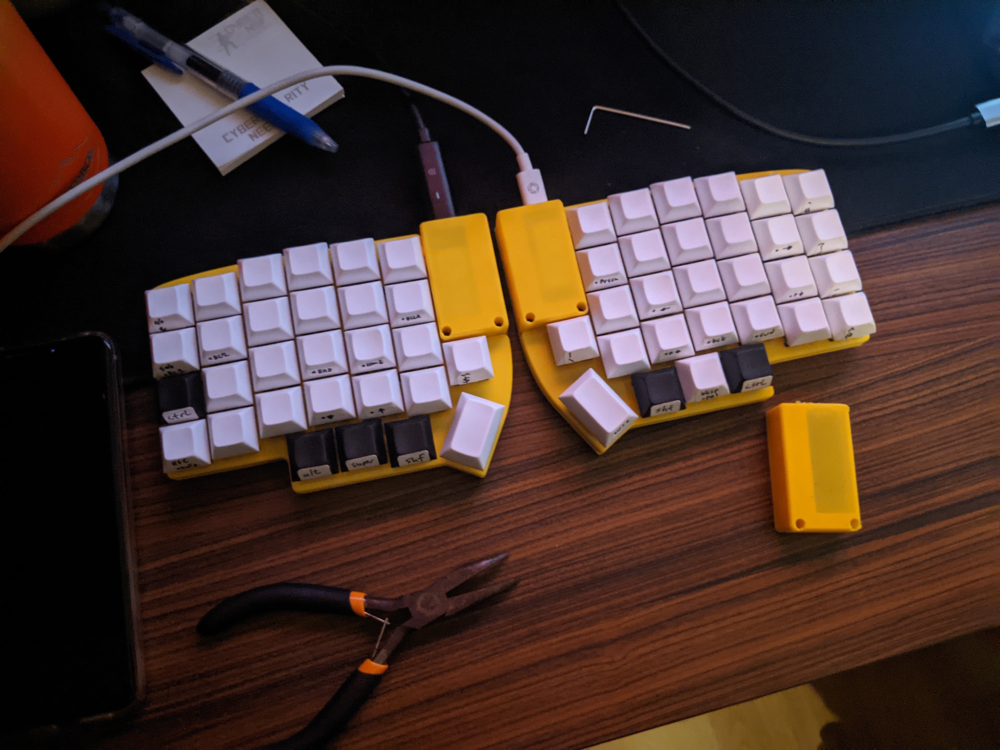
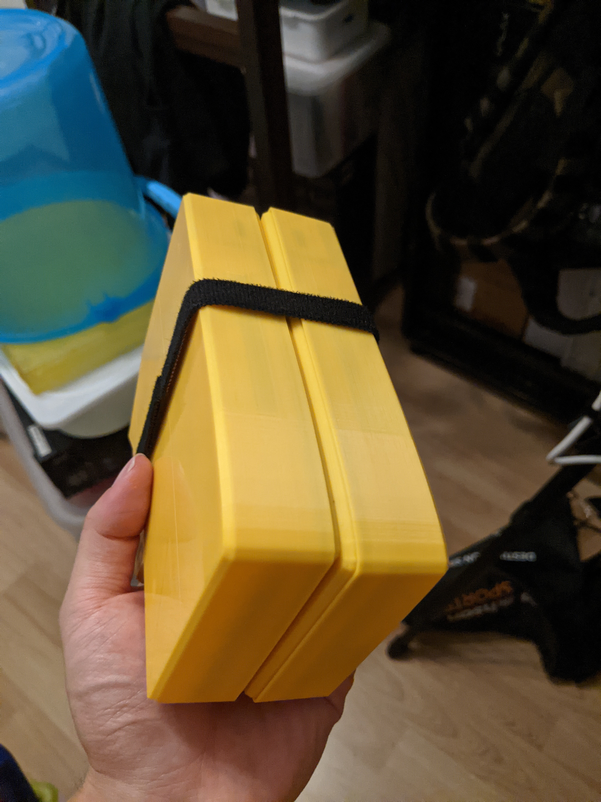
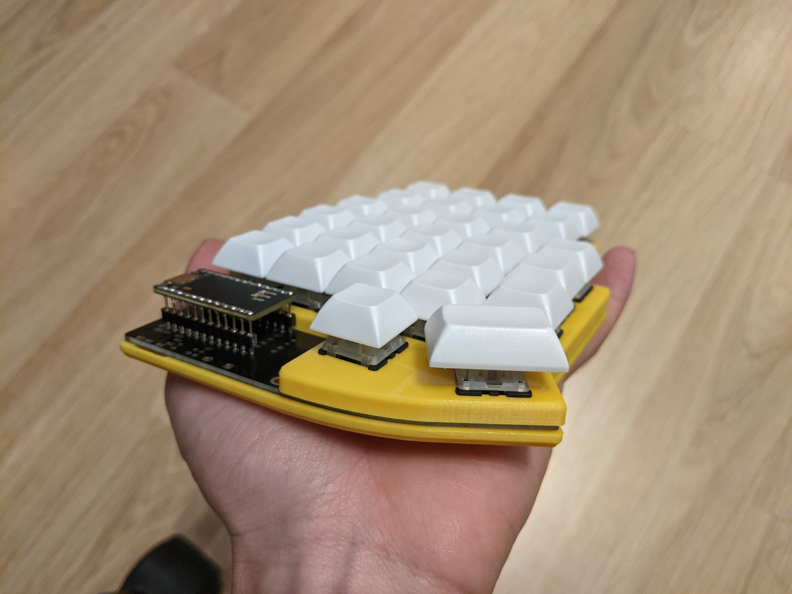
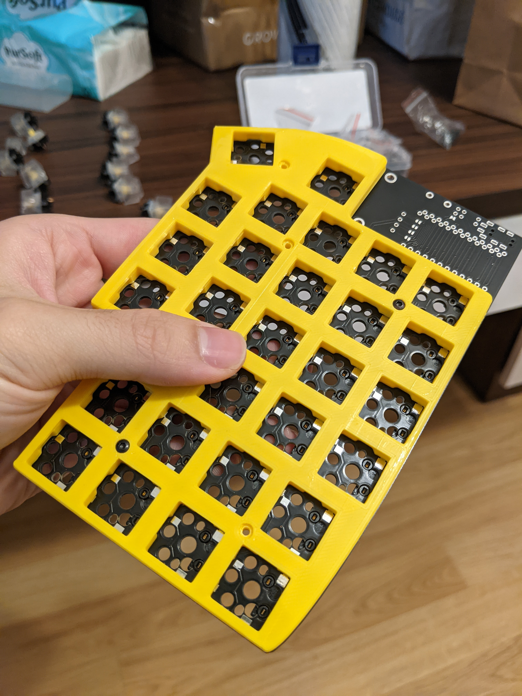

# Lily58 3D

3D-printed variant of the Lily58.

## Photos

## Hardware

You'll need the models printed, plus these parts per side:

- 7 &mul; M2 nuts
- 7 &mul; 8mm M2 bolts
  - Button/pan head bolts work well. A whole set of M2 bolts of different lengths is pretty affordable
  - Please check the 3D models again before buying specific lengths, I am unsure if this is the right lengths

<!-- vim: set conceallevel=2 et ts=2 sw=2: -->
